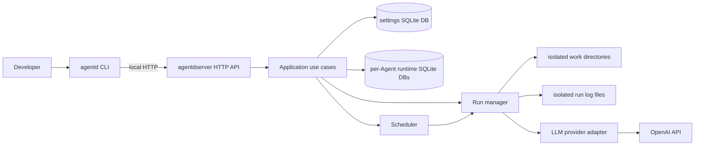
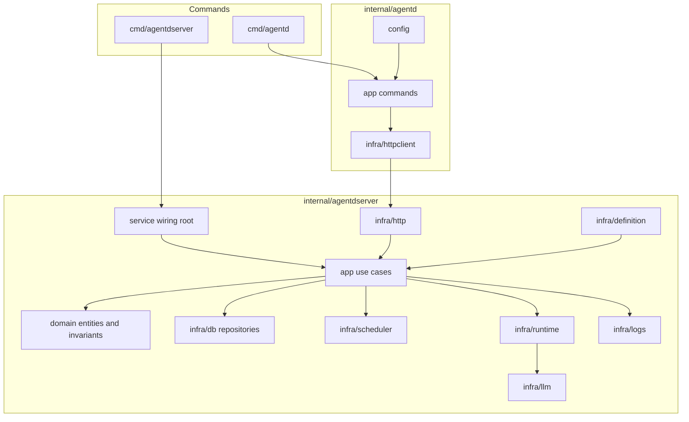
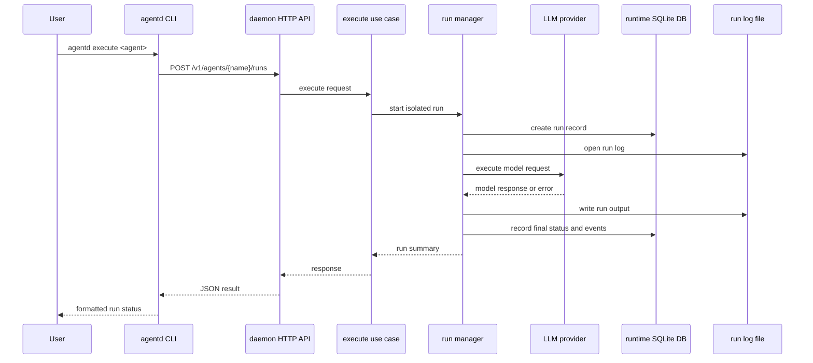

# agentd

agentd is a local daemon and CLI for running AI Agents from Markdown Agent Definition files. It treats an Agent Definition as code: validate it, apply it to a local daemon, inspect stored state, trigger manual runs, and read isolated run logs.

The project currently targets a single-user developer machine. It is built as one Go module with two binaries:

- `agentd`: CLI for apply, list, inspect, execute, stop, and logs operations.
- `agentdserver`: local daemon that validates definitions, stores state, schedules and runs Agents, and exposes a local REST API.

## Status

agentd is early-stage software. The daemon, CLI, definition parser, SQLite-backed state, OpenAI provider path, runtime lifecycle, and isolated log plumbing are implemented and covered by tests. APIs, Agent Definition schema details, and runtime behavior may still change before a stable release.

Local script tools can be declared in Agent Definitions and are persisted as part of the definition. Full execution of arbitrary local script tools is not complete unless implemented in a later change; current execution is centered on the LLM provider runtime path.

## Install

```bash
go install github.com/vitalii-honchar/agentd/cmd/agentd@latest
go install github.com/vitalii-honchar/agentd/cmd/agentdserver@latest
```

For development from a checkout:

```bash
go run ./cmd/agentdserver
go run ./cmd/agentd --help
```

## Quickstart

Create a local `.env` from the example and fill in only the values you need:

```bash
cp .env.example .env
```

`OPENAI_API_KEY` is required only when executing OpenAI-backed Agents.

Start the daemon:

```bash
go run ./cmd/agentdserver
```

Apply, list, inspect, execute, and read logs:

```bash
go run ./cmd/agentd apply examples/release-notes-helper.md
go run ./cmd/agentd list
go run ./cmd/agentd inspect release-notes-helper
go run ./cmd/agentd execute release-notes-helper
go run ./cmd/agentd logs release-notes-helper
```

Read a specific run if needed:

```bash
go run ./cmd/agentd logs release-notes-helper --run <run_id> --tail 100
```

The product research example uses portable placeholder paths. Replace `/path/to/ai-product-research` with your local project path before applying it:

```bash
go run ./cmd/agentd apply examples/ai-product-research.md
```

## Configuration

The daemon and CLI read configuration from environment variables and a local `.env` file when present.

Common variables:

- `OPENAI_API_KEY`: OpenAI provider credential, read from the environment only.
- `AGENTD_DATA_DIR`: base runtime data directory, default `./data`.
- `AGENTD_SETTINGS_DB_PATH`: settings database path, default `./data/agentd-settings.db`.
- `AGENTD_RUNTIME_DB_DIR`: per-Agent runtime database directory, default `./data/agents`.
- `AGENTD_RUN_LOG_DIR`: per-run log directory, default `./data/logs`.
- `AGENTD_SERVER_HOST`: daemon bind host, default `127.0.0.1`.
- `AGENTD_SERVER_PORT`: daemon port, default `18080`.
- `AGENTD_SERVER_URL`: CLI daemon URL, default `http://127.0.0.1:18080`.

Never put secret values in Agent Definition files, examples, issues, logs, or committed configuration.

## Architecture

agentd follows a daemon-first design. The `agentd` CLI is intentionally thin:
it parses commands, formats output, and calls the local daemon over HTTP. The
`agentdserver` daemon owns validation, persistence, scheduling, execution,
restart recovery, and log access.



The server keeps domain rules independent from transport, storage, scheduling,
and provider details. Application use cases define the daemon operations, while
infrastructure adapters handle HTTP, Markdown parsing, SQLite repositories,
cron-compatible scheduling, isolated runtime setup, run log IO, and LLM
providers. OpenAI is the first provider adapter behind the runtime provider
port.



Applied Agent Definitions, schedule metadata, and access policy live in one
settings SQLite database. Each Agent gets its own runtime SQLite database for
Agent Runs, runtime events, and log references. Run logs are separate files
under `AGENTD_RUN_LOG_DIR`, and each run gets an isolated work directory under
the daemon data directory.



The main implementation lives under `internal/agentd` for the CLI and
`internal/agentdserver` for the daemon. Spec Kit design artifacts remain under
`specs/`, while public development docs live under `docs/`.

## Development

```bash
go mod download
go test ./...
```

More local setup notes are in `docs/development.md`. Operational logging guidance is in `docs/observability.md`.

## Contributing

Contributions are welcome. Start with `CONTRIBUTING.md`, open an issue for larger changes, and keep PRs focused.

## License

Apache-2.0. See `LICENSE`.
