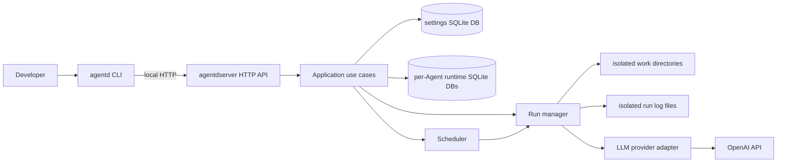
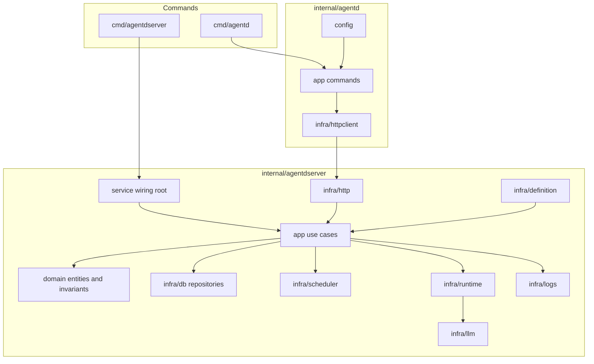
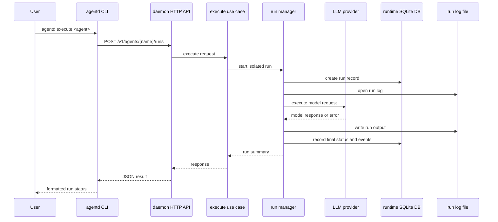

# agentd

agentd is a local daemon and CLI for running AI Agents from Markdown Agent Definition files. It treats an Agent Definition as code: validate it, apply it to a local daemon, inspect stored state, trigger manual runs, and read isolated run logs.

The project currently targets a single-user developer machine. It is built as one Go module with two binaries:

- `agentd`: CLI for apply, list, inspect, execute, stop, and logs operations.
- `agentdserver`: local daemon that validates definitions, stores state, schedules and runs Agents, and exposes a local REST API.

## Status

agentd is early-stage software. The daemon, CLI, definition parser, SQLite-backed state, OpenAI provider path, runtime lifecycle, declared local tool execution, result retrieval, and isolated log plumbing are implemented and covered by tests. APIs, Agent Definition schema details, and runtime behavior may still change before a stable release.

## Install

agentd requires Go 1.26.2 or newer.

Install the latest published CLI and daemon binaries directly with Go:

```bash
go install github.com/vitalii-honchar/agentd/cmd/agentd@latest
go install github.com/vitalii-honchar/agentd/cmd/agentdserver@latest
```

Make sure Go's binary directory is on your `PATH`:

```bash
export PATH="$(go env GOPATH)/bin:$PATH"
agentd --help
agentdserver --help
```

To install from a local checkout instead of the latest published version:

```bash
git clone git@github.com:vitalii-honchar/agentd.git
cd agentd
go mod download
go install ./cmd/agentd ./cmd/agentdserver
```

You can also use the project `Makefile`:

```bash
make install
make runserver
```

## Quickstart

Create a local `.env` from the example and fill in only the values you need:

```bash
cp .env.example .env
```

`OPENAI_API_KEY` is required only when executing OpenAI-backed Agents.

Start the daemon:

```bash
make runserver
```

Apply, list, inspect, execute, and read logs:

```bash
go run ./cmd/agentd apply examples/hacker-news-builder-brief/hacker-news-builder-brief.md
go run ./cmd/agentd list
go run ./cmd/agentd inspect hacker-news-builder-brief
go run ./cmd/agentd execute hacker-news-builder-brief
go run ./cmd/agentd ps -a
go run ./cmd/agentd result hacker-news-builder-brief
go run ./cmd/agentd logs hacker-news-builder-brief
```

Read a specific run if needed:

```bash
go run ./cmd/agentd result <run_id>
go run ./cmd/agentd logs hacker-news-builder-brief --run <run_id> --tail 100
```

The manual website snapshot example accepts run-time input:

```bash
go run ./cmd/agentd apply examples/website-snapshot-analyst/website-snapshot-analyst.md
go run ./cmd/agentd execute website-snapshot-analyst --input url=https://example.com
```

## Examples

Examples live in self-contained folders under `examples/`. Each folder includes
an Agent Definition, README, fixtures or source lists, and any declared CLI tool
scripts. The examples avoid dedicated infrastructure; most work with bundled
fixtures if live public-source reads fail. Install only the language/runtime
dependencies called out in the example README.

- `cybersecurity-reddit-watch`: monitors r/cybersecurity for vulnerabilities,
  leak reports, exploit chatter, and urgent defensive action.
- `hacker-news-builder-brief`: daily Hacker News API brief for engineers and
  builders.
- `reddit-customer-pain-monitor`: daily product-manager brief of repeated pains
  from public Reddit communities.
- `product-hunt-launch-radar`: daily launch radar from a bundled Product Hunt
  sample for competitive/product discovery.
- `github-trending-engineering-radar`: monitors high-signal repositories by
  language for engineering trend spotting.
- `developer-dependency-release-monitor`: watches common dependency release
  sources and summarizes upgrade risk.
- `ai-engineering-hiring-signal-monitor`: tracks public AI engineering hiring
  signals from bundled source definitions.
- `website-snapshot-analyst`: manual Puppeteer-based screenshot and summary
  workflow for a user-provided URL.

Declared tools run as separate CLI processes with bounded execution, stdout and
stderr summaries, persisted tool execution records, and scoped action logs.

## Configuration

The daemon and CLI read configuration from environment variables and a local `.env` file when present.

Common variables:

- `OPENAI_API_KEY`: OpenAI provider credential, read from the environment only.
- `AGENTD_DATA_DIR`: base runtime data directory, default `./data`.
- `AGENTD_SETTINGS_DB_PATH`: settings database path, default `./data/agentd-settings.db`.
- `AGENTD_RUNTIME_DB_DIR`: per-Agent runtime database directory, default `./data/agents`.
- `AGENTD_RUN_LOG_DIR`: per-run log directory, default `./data/logs`.
- `AGENTD_SERVER_HOST`: daemon bind host, default `127.0.0.1`.
- `AGENTD_SERVER_PORT`: daemon port, default `18080`.
- `AGENTD_SERVER_URL`: CLI daemon URL, default `http://127.0.0.1:18080`.

Never put secret values in Agent Definition files, examples, issues, logs, or committed configuration.

## Architecture

agentd follows a daemon-first design. The `agentd` CLI is intentionally thin:
it parses commands, formats output, and calls the local daemon over HTTP. The
`agentdserver` daemon owns validation, persistence, scheduling, execution,
restart recovery, and log access.



The server keeps domain rules independent from transport, storage, scheduling,
and provider details. Application use cases define the daemon operations, while
infrastructure adapters handle HTTP, Markdown parsing, SQLite repositories,
cron-compatible scheduling, isolated runtime setup, run log IO, and LLM
providers. OpenAI is the first provider adapter behind the runtime provider
port.



Applied Agent Definitions, schedule metadata, and access policy live in one
settings SQLite database. Each Agent gets its own runtime SQLite database for
Agent Runs, runtime events, and log references. Run logs are separate files
under `AGENTD_RUN_LOG_DIR`, and each run gets an isolated work directory under
the daemon data directory.



The main implementation lives under `internal/agentd` for the CLI and
`internal/agentdserver` for the daemon. Spec Kit design artifacts remain under
`specs/`, while public development docs live under `docs/`.

## Development

```bash
go mod download
go test ./...
```

More local setup notes are in `docs/development.md`. Operational logging guidance is in `docs/observability.md`.

## Contributing

Contributions are welcome. Start with `CONTRIBUTING.md`, open an issue for larger changes, and keep PRs focused.

## License

Apache-2.0. See `LICENSE`.
